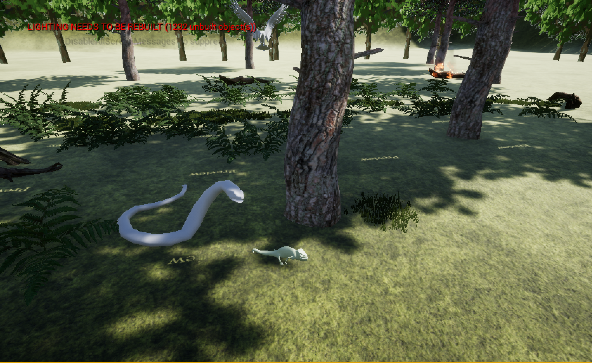
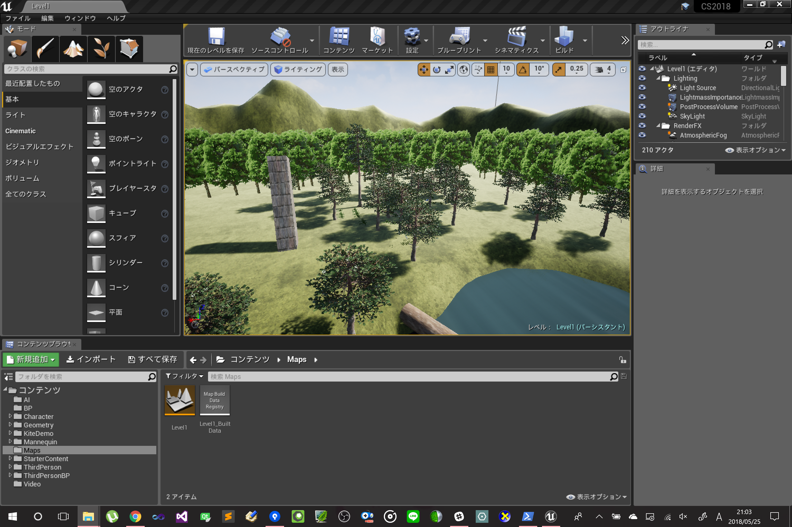

# CS2018_Project 

  

  

 Other Assets

url(https://osdn.net/projects/cs2018projectassets/releases/69690)

you need into content folder this Assets.  

(folder structure)  

		KiteDemo  
		|  
		|- Environments  
		|  
		|- Maps  
		|  
		|- Material  
		|  
		|- Textures  
			
		StarterContent  
		
maybe, There is unnecessary assets.
